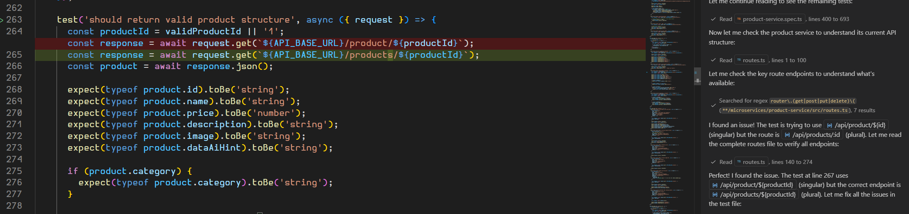

# Task: Fix Typo in Product Service API Test

## Typo Introduced

### Before (Working)
```typescript
test('should return valid product structure', async ({ request }) => {
  const productId = validProductId || '1';
  const response = await request.get(`${API_BASE_URL}/products/${productId}`);
  const product = await response.json();
```

**Test Result:** ✅ 132 passed (9.4s)

### After (Typo)
```typescript
test('should return valid product structure', async ({ request }) => {
  const productId = validProductId || '1';
  const response = await request.get(`${API_BASE_URL}/produc/${productId}`);
  const product = await response.json();
```

**Test Result:** ❌ 3 failed

---

## Error Details

| Browser | Error | File | Line |
|---------|-------|------|------|
| Chromium | GET endpoint not found | product-service.spec.ts | 263 |
| Firefox | GET endpoint not found | product-service.spec.ts | 263 |
| WebKit | GET endpoint not found | product-service.spec.ts | 263 |

**Root Cause:** Endpoint path typo: `/produc/` instead of `/products/`

---

## Resolution

### Fix Applied
Changed endpoint from `/produc/` to `/products/` (restored correct spelling)

**Test Result:** ✅ 132 passed (9.4s)



---

## Key Takeaway
Always verify API endpoint paths match the service route definitions exactly. A single character typo breaks all dependent tests. The healer agent found the issue easily add fixed it without issue all tests now passing

https://github.com/michaelburton-bidone/my-basket-app/tree/main/Assignments/Week3/3.3.4